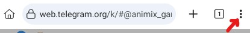
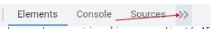
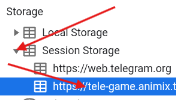
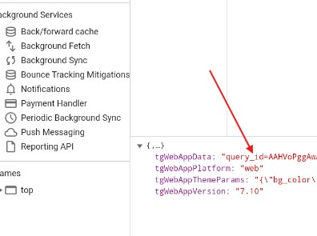
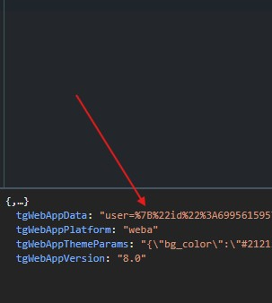
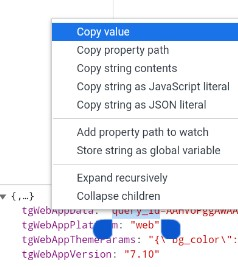
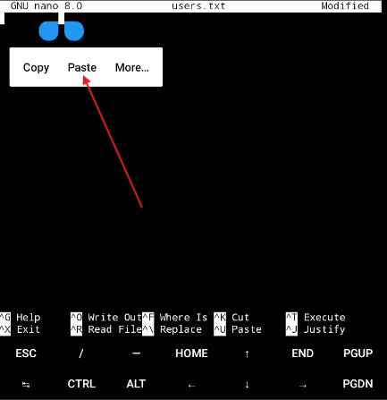
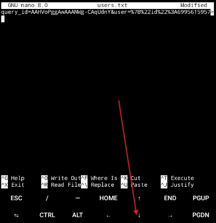
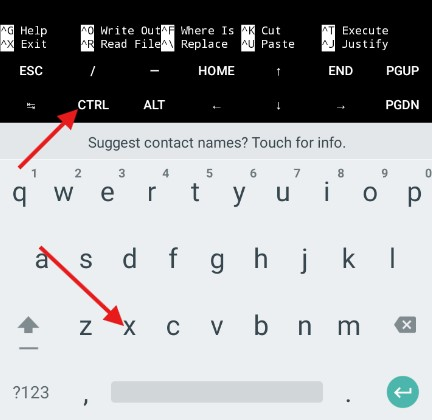
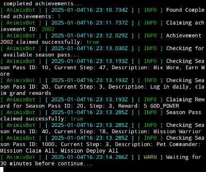

This script automates various tasks for the Animix miniapp telegram.

## Features

- **Auto Join/Claim Missions**
- **Auto Gatcha New Pets**
- **Auto Complete Quests**
- **Auto Merge Pets**
- **Auto Claim Rewards**
- **Support Multi accounts**

## Prerequisites

- Kiwi Browser ( You can download it on Playstore )
- Termux app ( `https://github.com/termux/termux-app/releases/download/v0.118.1/termux-app_v0.118.1+github-debug_universal.apk` )
- Open Kiwi Browser, and login your Telegram
- Open Animix miniapp on web telegram `https://t.me/animix_game_bot`
- Click the 3 dots  then select Developer Tools 
- in developer tools, tap the arrows beside Source 
- Expand the Session Storage and click the tele-game...
  
- in session storage find `tgWebAppData` and copy all value. `user=....` or `query_id....`
  
 
- Press and hold the value, and tap `Copy Value`...
  

## Installation

Open Termux app

1. Install Git:
    ```sh
    pkg install git
    ```
2. Install nodejs:
    ```sh
    pkg install nodejs
    ```
3. Install nodejs-lts
    ```sh
    pkg install nodejs-lts
    ```
4. Clone the repository:
    ```sh
    git clone https://github.com/ronsuru/ANMBAnimix.git
    ```
5. Change Directory:
    ```sh
    cd ANMBAnimix
    ```
6. Install the required dependencies:
    ```sh
    npm install
    ```
7. Input your user data in `users.txt` file, one user per line;
    ```sh
    nano users.txt
    ```
    You need to paste the `queryid...` or `user=...` that you copied from Kiwi Browser
   -  then tap `Paste`
   -  you can't see all the details but you can tap `↓` down arrow to make sure.
   - Here's how to exit  Tap `CTRL` then tap `X`
   - It will ask you Y/N to exit.. tap `Y`
   - It will ask you another question..  tap `CTRL` `M`
   - 
8. Finally, Run the script:
    ```sh
    npm run start
    ```


## 

This project is licensed under the [MIT License](LICENSE).
